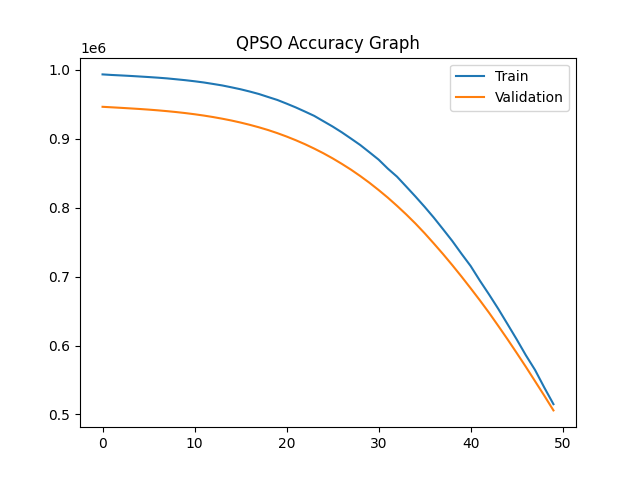

# Harmony Search Algorithm (HSA) Based Hyperparameter Optimization

## 📌 Project Overview

This project implements the **Harmony Search Algorithm (HSA)** to optimize hyperparameters of a **Random Forest Regressor** for regression tasks. The algorithm searches for the best combination of parameters to maximize model performance.

The system automatically:

* Applies Harmony Search Algorithm
* Tunes Random Forest hyperparameters
* Trains optimized model
* Evaluates performance
* Saves results with **hsa_ prefix**

---

## ⚙️ Algorithm Used

**Harmony Search Algorithm (HSA)** 🎵

Inspired by musical improvisation where musicians try different harmonies to find the best one.

### Key Parameters

* Harmony Memory Size (HMS)
* Harmony Memory Consideration Rate (HMCR)
* Pitch Adjustment Rate (PAR)
* Bandwidth (bw)
* Maximum Iterations

---

## 🤖 Machine Learning Model

* RandomForestRegressor
* Hyperparameters optimized:

  * `n_estimators`
  * `max_depth`

---

## 📊 Accuracy Visualization

Below is the optimization accuracy graph:



---

## 📂 Project Structure

```
project/
│
├── data.csv
├── hsa_model.py
├── README.md
├── qpso_accuracy_graph.png
│
├── hsa_predictions.csv
├── hsa_metrics.csv
├── hsa_actual_vs_predicted.png
├── hsa_residual_plot.png
└── hsa_best_params.txt
```

---

## 📊 Output Files (All with hsa_ prefix)

| File                        | Description                |
| --------------------------- | -------------------------- |
| hsa_predictions.csv         | Actual vs Predicted values |
| hsa_metrics.csv             | Model performance metrics  |
| hsa_actual_vs_predicted.png | Scatter plot               |
| hsa_residual_plot.png       | Residual plot              |
| hsa_best_params.txt         | Best hyperparameters       |

---

## 📈 Evaluation Metrics

The following metrics are calculated:

* R² Score
* RMSE (Root Mean Square Error)

---

## 🧠 How Harmony Search Works

1. Initialize harmony memory
2. Generate new harmony
3. Apply pitch adjustment
4. Evaluate fitness
5. Replace worst harmony
6. Repeat until convergence
7. Return best solution

---

## 🛠️ Requirements

Install dependencies:

```
pip install numpy pandas matplotlib scikit-learn
```

---

## ▶️ How to Run

1. Place dataset as `data.csv`
2. Ensure last column is target variable
3. Run:

```
python hsa_model.py
```

---

## 📉 Example Output

```
Iteration 1 Best R2: 0.8123
Iteration 2 Best R2: 0.8451
...
Iteration 20 Best R2: 0.9127
```

---

## 🧪 Hyperparameter Search Space

| Parameter    | Min | Max |
| ------------ | --- | --- |
| n_estimators | 10  | 200 |
| max_depth    | 2   | 20  |

---

## 🚀 Features

* Metaheuristic optimization
* Automatic model tuning
* Visualization plots
* Result saving
* Reproducible experiment
* Clean output files

---

## 📌 Use Cases

* Regression optimization
* Hyperparameter tuning
* Metaheuristic research
* Algorithm comparison studies
* Academic projects

---

## 👨‍💻 Author

**Sagnik Patra**

---

## 📜 License

This project is for educational and research purposes.
